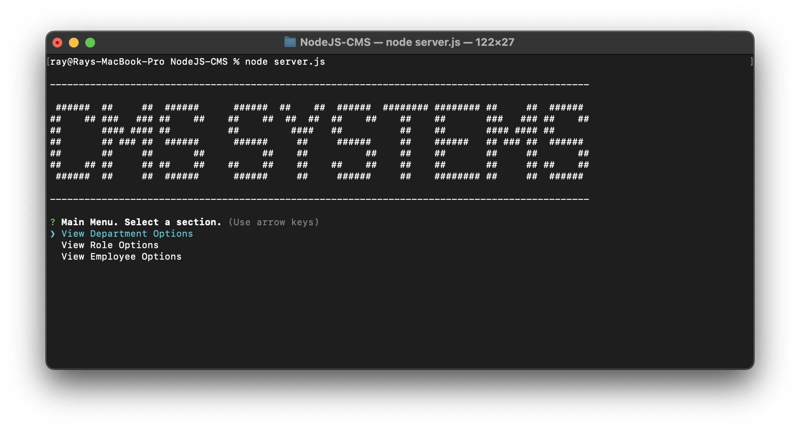

# NodeJS-CMS

## Description

- A Content Management System (CMS) application using NodeJS and mySQL as a company database.
- Using the command-line terminal, employees and departments within a company can be controlled and managed through this application.
- This application has improved my profienciency in back-end development, and has improved my understanding of databases.

## Features

- A main menu with options to manage your company's departments, company roles, and employees
- Departments: features to view, create, and delete departments in your company
- Roles: features to view, create, and delete roles in your company
- Employees: features to view, create, update, and delete employee information in your company
- Visual tables for overviewing your departments, roles, and employees

## Installation

1. Make sure you have NodeJS installed. [Download NodeJS Here](https://nodejs.org/en).
2. Clone this repository or download the source ZIP.
3. After extracting the repository, open your command-line terminal in your extracted file's directory
4. Type `npm i` to install the needed dependencies.
5. To execute the applcation, type `npm start` or `node server.js` in your command-line terminal.

## Usage

**To see a step-by-step tutorial on using this application, click on the image below [or click here.](./Assets/nodejs-cms-vid.mp4)**

## License

MIT License

Copyright (c) 2023 Ray Badua

Permission is hereby granted, free of charge, to any person obtaining a copy
of this software and associated documentation files (the "Software"), to deal
in the Software without restriction, including without limitation the rights
to use, copy, modify, merge, publish, distribute, sublicense, and/or sell
copies of the Software, and to permit persons to whom the Software is
furnished to do so, subject to the following conditions:

The above copyright notice and this permission notice shall be included in all
copies or substantial portions of the Software.

THE SOFTWARE IS PROVIDED "AS IS", WITHOUT WARRANTY OF ANY KIND, EXPRESS OR
IMPLIED, INCLUDING BUT NOT LIMITED TO THE WARRANTIES OF MERCHANTABILITY,
FITNESS FOR A PARTICULAR PURPOSE AND NONINFRINGEMENT. IN NO EVENT SHALL THE
AUTHORS OR COPYRIGHT HOLDERS BE LIABLE FOR ANY CLAIM, DAMAGES OR OTHER
LIABILITY, WHETHER IN AN ACTION OF CONTRACT, TORT OR OTHERWISE, ARISING FROM,
OUT OF OR IN CONNECTION WITH THE SOFTWARE OR THE USE OR OTHER DEALINGS IN THE
SOFTWARE.
